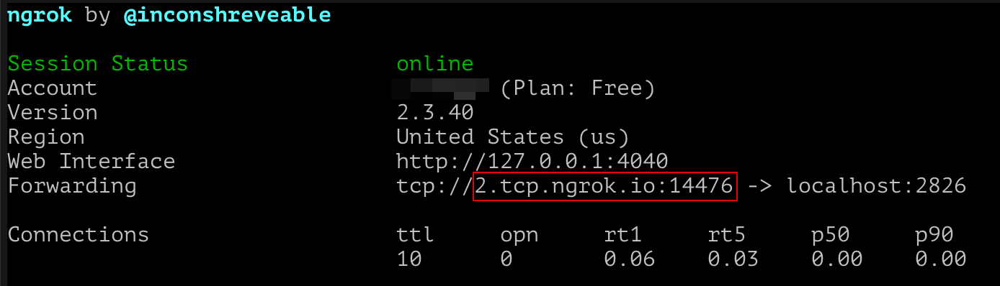

# 노드 운영 방법 및 조건

보스아고라 노드인 아고라(Agora)를 테스트 하는데 필요한 단계와 테스트 네트워크(‘TestNet’)에서 Foundation 노드와 상호 작용하는 방법을 안내드립니다.

## 검증자(Validator) VS 풀 노드(Full Node)

아고라는 풀 노드(Full Node) 또는 검증자(Validator) 두 가지의 모드 중 하나로 실행할 수 있습니다. 검증자를 실행하기 전에 풀 노드를 실행하는 방법을 익히는 것이 좋습니다. 잘못 구성하면 네트워크가 불안정해지고 보유 자금이 삭감되어 검증자를 실행할 수 없게 될 수 있습니다.

검증자는 인터넷에서 공개적으로 접근 가능해야 하므로 구성이 더 복잡합니다. 풀 노드에 적용되는 모든 지침은 검증자에도 적용됩니다. 이 안내서에서는 ‘풀 노드(Full Node)’는 단순히 ‘노드(Node)'라고 부릅니다.

## 시스템 요구 사항

다음은 노드를 실행하기 위한 최소 요구 사항입니다:
- x86_64 프로세서 또는 호환 가능한, > 2GHz
- 4GB RAM
- 1GB의 저장 용량
- Linux, Mac,Windows에 Docker 또는 WSL
- 인터넷 연결

2010년 이후에 제작된 대부분의 컴퓨터는 이러한 요구 사항을 충족할 것입니다.

## 도커 또는 네이티브 바이너리

Agora 실행 권장 방법은 도커 이미지를 사용하는 것입니다.
Ubuntu Linux 20.04 및 MacOS-11(Big Sur)용 네이티브 바이너리(Native Binaries)도 사용할 수 있습니다. 또한 [이 설명서](https://github.com/bosagora/agora#build-instructions)를 사용하여 아고라를 자신의 컴퓨터로 컴파일할 수도 있습니다.

도커 사용자의 경우 Docker가 아직 설치되지 않은 경우 [이 페이지](https://github.com/bosagora/agora#build-instructions)로 이동하셔서 설치하시면 됩니다.
아고라 다운로드는 첫 실행시 자동으로 이루어집니다.

네이티브 바이너리의 경우 [Agora의 릴리스 페이지](https://github.com/bosagora/agora/releases)로 이동하여 시스템과 일치하는 바이너리를 가져오면 됩니다.
최신 릴리스는 [이 페이지](https://github.com/bosagora/agora/releases/latest)에서 찾을 수 있습니다. 시스템과 일치하는 `agora` 바이너리를 찾으십시오.


이름을 클릭하면 다운로드됩니다. 다른 바이너리(`agora-config-dumper`, `agora-client`)는 보조 툴이며 노드를 실행하는 데 사용할 수 없습니다.

## 도커에서 풀 노드 실행

터미널을 열고 `docker run bosagora/agora --testnet` 명령을 사용합니다.

노드가 시작되고 여러 메시지를 화면에 나타나야 합니다. 약 몇초 동안 네트워크와 동기화를 시작하여 최신 상태의 체인을 다운로드해야 합니다.


이것은 네트워크와 동기화하는 노드를 실행하는 데 필요한 최소한의 작업입니다. 여러분의 노드는 다른 노드와 연결되지 않습니다.
검증자가 아니라 풀 노드이기 때문입니다. 추가적으로 도커를 사용하고 있기 때문에 프로그램을 종료( `Ctrl` + `C` 또는 Mac에서는 `Command` + `C`)하면 상태가 완전히 삭제됩니다.
다음에 노드를 다시 시작할 때 블록체인을 다시 다운로드해야 합니다. 블록체인을 다시 다운로드하지 않으려면 방법은 간단합니다. 아래와 같이 명령을 사용하여 도커 내부의 현재 디렉터리를 ‘마운트(mount)’하면 됩니다.
```shell
docker run -v $(pwd):/agora/ bosagora/agora --testnet
```

해당 명령을 사용하여 Agora를 시작하면 블록체인을 다시 다운로드할 필요는 없습니다.

## 풀 노드 추가 구성

Agora는 구성 파일을 사용하여 광범위하게 구성할 수 있습니다.
기본적으로 Agora는 실행이 시작된 디렉터리에서 `config.yaml`을 찾지만 `-c` 명령줄 옵션을 사용하여 Agora에 구성 파일을 제공할 수 있습니다.
`--testnet`을 사용하는 것은 구성 파일 없이 Agora를 시작할 수 있는, 간단한 방법입니다.

이 디렉토리에서 [간단한 구성 파일을](./config.yaml) 찾을 수 있으며, [예시 구성 파일](/doc/config.example.yaml)에 명시된 지시문을 사용하여 필요에 맞게 수정할 수 있습니다.

그 설정 파일을 사용하려면 Agora를 실행하는 디렉토리에 복사하고 다음 명령을 사용하면 됩니다.
```shell
# 만약 자신의 설정 파일의 이름이 `config.yaml`이면 다음의 명령을 사용하세요.
docker run -v $(pwd):/agora/ bosagora/agora
# 그렇지 않고, 설정 파일의 이름이 `my_config.yaml`인 경우는  다음의 명령을 사용하세요:
docker run -v $(pwd):/agora/ bosagora/agora -c my_config.yaml
```

## 검증자 실행

검증자를 실행하려면 먼저 서버 실행의 기본 사항을 숙지해야 합니다. 특히 접속할 수 없는 노드가 네트워크에 의해 제거되어 검증자를 계속 실행할 수 없게 되므로 공개적으로 접속할 수 있는 컴퓨터 또는 서버가 있어야 합니다.

검증자를 실행하는 첫 번째 단계는 개인티/공개키 쌍을 생성하는 것입니다. [테스트넷 월렛(TestNet Wallet)](https://testnet.boawallet.io/)에서 수행할 수 있습니다.


보시다시피 키 쌍은 두 개로 나뉩니다. S로 시작하고 모두 대문자인 개인키는 절대 공유하면 안 됩니다. 공개키는 boa1으로 시작하며 제3자와 자유롭게 공유할 수 있습니다. 개인키 부분은 때때로 ‘시드(Seed)’라고도 합니다. 다음 예에서는 시드 및 공개키에 대해 위의 값을 사용합니다. 실제 명령의 실행이나 구성파일 작성시 여러분의 키값으로 대체해야 합니다.

적절한 키 쌍을 생성한 후 등록하려면, 40,000개 코인을 동결해야 지분을 받을 수 있습니다. 테스트에 참여하는 사용자를 위해 지분을 생성할 페이지인 [Faucet](https://faucet.bosagora.io/)를 이용하면 쉽게 그 작업을 할 수 있습니다.


위의 작업이 완료되면, 구성 파일을 다음과 같이 변경하면 됩니다.
```yaml
node:
  public_addresses:
    - "agora://my-address.example.com:2826"

validator:
  enabled: true
  seed: SB3EENDWPUGQZL7KLWGJS2ILMGRBB2MLVLRBUVKDYTO6A4WYLPIQWEE3
```

설정 파일에서는 **시드**를 사용하고 Faucet에 **공개키**를 사용해야 합니다.

`addresses_to_register` 항목에 들어갈 주소는 여러분의 **퍼블릭 주소**와 일치해야 합니다.
이것은 IP 주소일 수도 있고, 호스트 네임일 수도 있습니다. 위의 예의 경우, `2826` 포트를 명시적으로 사용합니다.
하지만 다음의 예와 같이, `interfaces` 항목에서 다르게 설정할 수도 있습니다.
```yaml
interfaces:
  - type: tcp
    address: "0.0.0.0"
    port: 3000
```

만약 도커가 사용한다면, 도커 실행시 포트가 노출되도록 지정해주어야 합니다.
그것은 `-p` 옵션을 사용하면 되는데, `docker run -p 2826 [...]`와 같은 형태의 명령을 사용하여 도커를 실행합니다.

노드를 시작 후 몇 분 정도 기다리면 자체적으로 등록되고 검증을 시작해야 합니다. 또한 본인의 IP주소를 가리키는 다음과 같은 주소를 확인하여 노드에 접속할 수 있는지 확인가능합니다.
`boa1xrwuel4csj4acdfdr5c6xufewa7r5l5g83cp5uax2lyxaakkhwc27aghk7m.validators.testnet.bosagora.io`

## `ngrok`을 이용하여 검증자를 인터넷에 노출하는 방법
이전 섹션의 설명을 통해서, 여러분은 검증자를 실행할 수 있게 되었습니다. 그러나, 공개된 IP 없이 로컬 컴퓨터에서
검증자가 실행된다면, 다른 검증자들이 여러분의 검증자에 접근할 수 없습니다. 하나의 옵션으로, [ngrok](https://ngrok.com)과 같은 서비스를
이용하여 로컬 포트를 공개할 수 있습니다. 여러분이 풀 노드를 운영하고 있다면, 이 섹션은 건너 뛰어도 됩니다.

만약 검증자를 이미 실행하고 있다면, 다음의 절차들을 적용하기 전에 여러분의 검증자를 중단하십시오.

**첫번째**, `ngrok`을 사용하기 전에, 여러분은 `ngrok` 사이트에서 등록(Sign up)하여 계정을 만들어야 합니다.
`ngrok`은 기본적으로 프리 플랜(free plan)을 제공하는데, 하나의 프로세스만 사용할 수 있고, 최대 4개의 터널과
하나의 랜덤 포트를 사용할 수 있습니다. 프리 플랜은 여러분의 검증자를 운영하기에 충분합니다.


**두번째**, `ngrok` 클라이언트 프로그램을 설치하고 나서, 다음의 명령을 이용하여 여러분의 계정을 클라이언트에
연결해야 합니다. (이 작업은 한번만 수행하면 됩니다).
```
./ngrok authtoken <your_auth_token>
```
계정에 대한 인증 토큰(`<your_auth_token>` 부분에 들어갈 내용)은 `ngrok` 사이트에서 대시보드의 `Auth` 메뉴에서
찾을 수 있습니다.


**세번째**, 여러분의 시스템에서 사용되지 않는 포트를 사용하여, 다음의 `tcp` 명령을 통해서 해당 포트를 네트워크에 오픈합니다.
```
./ngrok tcp 2826
```
다음의 스크린샷은 위의 명령의 실행 결과를 보여줍니다.

위 화면에서 빨간색 네모로 표시된, TCP 주소를 복사해야 합니다. 이 주소는 여러분의 설정파일에서 사용됩니다.

**네번째**, 이제 위에서 복사한 TCP 주소를, 설정 파일의 `public_addresses` 부분에 아래와 같이 복사해야 합니다.
```
node:
  public_addresses:
    - "agora://2.tcp.ngrok.io:14476"
```
그리고 나서, 이전 섹션에서 설명된 것처럼 검증자를 실행하면 됩니다.

## 노드 업데이트

지속적으로 Agora가 개선됨에 따라 새로운 버전이 주기적으로 출시될 것입니다.
네이티브 바이너리 사용자의 경우, Agora repository를 팔로우하셔서 알림을 받으십시오.
도커 사용자의 경우, 특히 노드에 오류가 표시되기 시작하는 경우 때때로 `docker pull bosagora/agora`를 수행하면 도움이 됩니다.


## 문제 보고

테스트 기간중 발견한 문제는 [이 페이지](https://github.com/bosagora/agora/issues)에서 보고할 수 있습니다.
문제 사항에 대해서만 보고할 수 있고, 보고하시기 전에 여러분이 확인한 현상이 기존에 있는 문제인지 확인하십시오. 확인된 현상이 문제인지 확실하지 않은 경우, 가장 좋은 방법은 [이 페이지](https://github.com/bosagora/agora/discussions/categories/q-a)에서 질문하는 것입니다.
