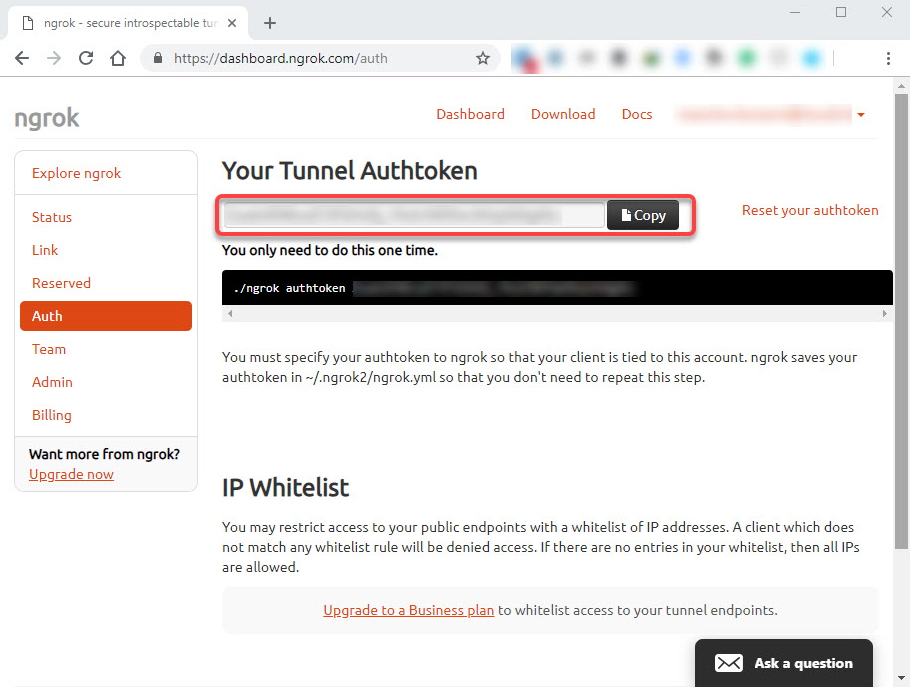
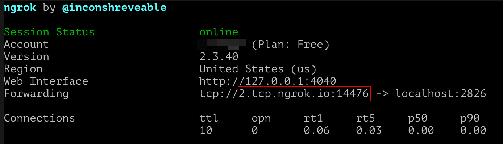

# Introduction

This document will guide you through the steps required to try out Agora, BOSAGORA's node,
and in particular how to interact with Foundation nodes in the test network ("TestNet").

## Validator vs full nodes

Agora can run in one of two major modes: Full node, and validator. We recommend one to familiarize themselves with running
a full node before attempting to run a validator, as misconfiguration could lead to network instability and likely result
in one's inability to run a validator as the fund will get slashed.

A validator also requires to be publicly accessible on the internet, making the configuration more complicated.
All the instructions that apply to full nodes apply to validators as well.
For brevity, instructions will simply refer to full nodes as "node(s)".

## System requirements

The following are minimum requirements to run a node:
- x86_64 processor or compatible, > 2 GHz
- 4 GBs of RAM;
- 1 GB of free space;
- Linux, Mac, or Windows with either Docker or WSL;
- Internet connection;

In practice, most consumer computers built after 2010 will satisfy those requirements.

## Docker or native binaries

The recommended way to run Agora is via the docker image.
Native binaries for Ubuntu Linux 20.04 and MacOS-11 (Big Sur) are also available.
One may also elect to compile Agora on their own machine using the instructions [here](https://github.com/bosagora/agora#build-instructions).

For Docker users, if Docker is not yet installed, head [here](https://www.docker.com/get-started).
Agora download will be automatically done on first run, you do not have anything to do at this point.

For native binaries, head over to [Agora's release page](https://github.com/bosagora/agora/releases) and grab the binary matching your system.
You can find the latest release [here](https://github.com/bosagora/agora/releases/latest).
Look for the `agora` binary matching your system:


Clicking on the name will download it. Other binaries (`agora-config-dumper`, `agora-client`) are side tools
and cannot be used to run a node.

## Running a full node under Docker

Open a terminal and use the command `docker run bosagora/agora --testnet`.

The node should start, and print a bunch of messages to the screen. It should start synchronizing
with the network about a few seconds, downloading the current state of the chain.
The messages should look like this:


Bear in mind that this is the minimum required to run a node that synchronize with the network.
Your node will not be contacted by other nodes - it is not a validator, just a full node.
Additionally, because we are using Docker, stopping the program (press `Ctrl` + `C` or `Command` + `C` on Mac)
will completely wipe out the state: the next time you start the node, it will re-download the blockchain.

A simple way to avoid re-downloading the blockchain is to "mount" the current directory inside Docker
with the following command:
```shell
docker run -v $(pwd):/agora/ bosagora/agora --testnet
```

As long as you use this command to start Agora, you will not have to always re-download the chain.

## Configuring a full node further

Agora can be extensively configured via the use of a configuration file.
By default, Agora will look for `config.yaml` in the directory it is started in, but using the `-c`
command line option, you can give Agora any configuration file.
Using `--testnet` is a special way to make Agora start without a configuration file.
Consensus configuration of a node must be compatible with preferred network to be participated thus `--testnet` flag is always required to fetch consensus configuration of the test network, even if a configuration file is provided.

You can find a [simple configuration file in this directory](./config.yaml), which you may modify to suit your own needs,
using the directives listed in the [example configuration file](/doc/config.example.yaml)

To use it, simply copy it in the directory where you run Agora and use the following command:
```shell
# Use this if your file is named `config.yaml`
docker run -v $(pwd):/agora/ bosagora/agora
# Or use the following for a file named `my_config.yaml`:
docker run -v $(pwd):/agora/ bosagora/agora -c my_config.yaml
```

## Running a validator

Before you can run a validator, you must be familiar with the basics of running a server.
In particular, you **MUST** have a publicly-accessible computer or server,
as a non-accessible node will eventually be slashed by the network, resulting in your
inability to continue running a validator.

The first step to run a validator is generate a public / private key pair.
This can be done on the [testnet wallet](https://testnet.boawallet.io/)


As you can see, the key pair comes in two parts:
The private part which starts with `S` and is all uppercase, should never be shared.
The public part starts with `boa1` and can be freely shared with third party.
The private part is sometimes also refered to as a "seed".
The following examples use the above values for seed and public key.
In your own commands and configuration, they should be replaced with your own values.

Once you have generated a suitable key pair, you need to get a frozen stake worth
40,000 coins to be able to register. We've made it easy by providing a page that
will create the stake for you: [Faucet](https://faucet.bosagora.io/).


Once this is done, all you have to do is to change your configuration file
to the following:
```yaml
validator:
  enabled: true
  seed: SB3EENDWPUGQZL7KLWGJS2ILMGRBB2MLVLRBUVKDYTO6A4WYLPIQWEE3
```

Make sure you use the **seed** for the configuration and the **public key** for Faucet.

Interfaces will be registered to public registry by default. If your validator's
interface is not directly accessible to public, i.e. behind a reverse proxy,
`public_addresses` or `register` fields of an interface can be configured.
This can be an URL address or a hostname. The above example uses port `2826` explicitly,
but you may elect to change it by using an interface entry, for example:
```yaml
interfaces:
  - type: tcp
    address: "0.0.0.0"
    port: 3000
```

If docker is being used, it also needs to be instructed to expose the port.
This is done with the `-p` option, e.g. `docker run -p 2826 [...]`.

Once you start the node, and wait up to a few minutes, it should enroll by itself
and start validating. You can also make sure your node is accessible by checking
that `boa1xrwuel4csj4acdfdr5c6xufewa7r5l5g83cp5uax2lyxaakkhwc27aghk7m.validators.testnet.bosagora.io`
points to your own IP address.

## Exposing your validator on the internet with `ngrok`
As you have read in the previous section, you can run a validator, but if the validator runs on
a local computer without a publicly exposed ip, it cannot be reached from other validators.
One option is to use a service like [ngrok](https://ngrok.com) to expose a local port to the public. If you only run
a full node, not a validator, please skip this section.

You should stop your validator before following the following instructions.

**First**, to use `ngrok`, you need to register yourself on the `ngrok` web site and create an account.
`ngrok` has a free plan that allows you to use the software for free with the limitation of only
one process at a time with a maximum of four tunnels and a random port, but it is enough to run
your validator.


**Second**, once you download the `ngrok` client, you have to connect your account to the client
(you need to do this operation once only) using the following command:
```
./ngrok authtoken <your_auth_token>
```
You can find your authentication token in the Auth section of your account dashboard.


**Third**, to expose your validator using `ngrok`, simply expose a local port, currently not being used,
using the `tcp` command.
```
./ngrok tcp 2826
```
The following screenshot shows the output of the preceding command:

You should copy the TCP address provided marked on a red line in the previous screenshot,
which will be used in your configuration file.

**Fourth**, you should replace the value of the `public_addresses` to the copied address
in your configuration file that you have already written.
```
node:
  public_addresses:
    - "agora://2.tcp.ngrok.io:14476"
```
And then, you can run your validator as described in the previous sections.

## Updating your node

As we are constantly improving Agora, new versions will be released periodically.
For native binary users, follow the Agora repository to get a notification.
For `docker` users, doing `docker pull bosagora/agora` from time to time,
especially if your node starts to show errors, should help.

## Reporting issues

You can report issues you find [here](https://github.com/bosagora/agora/issues).
Make sure what you are reporting is an issue, and there isn't an existing issue covering yours.
If you aren't sure if the behavior you are seeing is an issue, the best way is to ask [here](https://github.com/bosagora/agora/discussions/categories/q-a).
